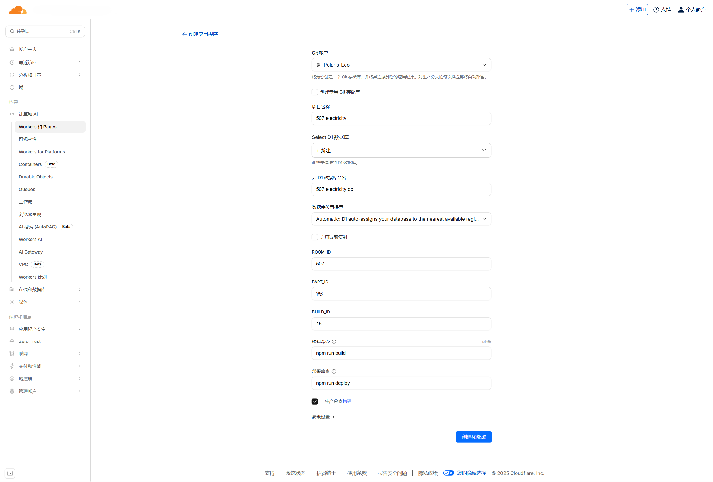
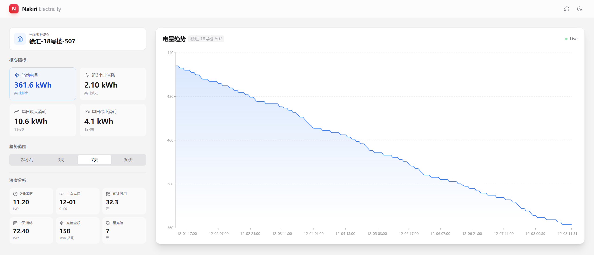

# Nakiri Electricity Cloudflare

这是一个基于 React 和 Cloudflare Workers 的全栈电量监测系统模板。<br>
特点：单体架构 (Monolith)，零成本，自动爬虫，美观图表。

### 🚀 快速开始
点击即可一键部署到Cloudflare上（需要Cloudflare账户）<br>  
[](https://deploy.workers.cloudflare.com/?url=https://github.com/Polaris-Leo/Nakiri-Electricity-Cloudflare)<br>  
**你需要修改3个环境变量，替换成你自己的信息**
```
PART_ID = 校区  #（如：PART_ID = 奉贤）（奉贤|徐汇）
BUILD_ID = 楼号  #（如：BUILD_ID = 18 代表18号楼）
ROOM_ID = 宿舍号  #（如：ROOM_ID = 101）
```


#### 示例配置：
##### 示例配置1：
奉贤校区，5号楼，202：
```
PART_ID = 奉贤
BUILD_ID = 5
ROOM_ID = 202
```
##### 示例配置2：
徐汇校区，13号楼，405：
```
PART_ID = 徐汇
BUILD_ID = 13
ROOM_ID = 405
```
##### 示例配置3：
特殊楼栋 (徐汇南区4A)：
```
PART_ID = 徐汇
BUILD_ID = 南区4A
ROOM_ID = 101
```

## Nakiri Electricity 是一个现代化、高颜值的宿舍电量监控面板。

它可以帮助你实时追踪特定房间的电力消耗情况，提供详细的图表分析、充值记录检测以及剩余可用天数估算。



✨ 功能特性

📊 深度数据分析：

实时电量趋势图（支持平滑曲线与数据点交互）。

核心指标看板：当前余量、近3小时消耗、单日最大/最小消耗。

深度分析：24小时消耗、7天消耗、上次充值金额及时间、预计可用天数估算。

🎨 现代化 UI 设计：

基于 Tailwind CSS 的响应式布局，完美适配桌面与移动端。

原生支持 深色模式 (Dark Mode)，随系统自动切换或手动切换。

丝滑的 Framer Motion 交互动画。

🤖 自动化运行：

内置 Cron 定时任务，每小时自动抓取最新数据。

智能识别充值行为（排除充值带来的电量跳变干扰消耗计算）。

### 🛠️ 手动部署
#### 1. 安装依赖
```
npm install
```

#### 2. 创建数据库
```
npx wrangler d1 create nakiri-db
```

复制终端输出的 database_id。

#### 3. 配置项目

打开 wrangler.toml：

填入上一步获取的 database_id。

在 [vars] 部分修改本地测试用的房间号。

#### 4. 初始化数据库表
```
npm run db:init
```

#### 5. 一键部署
```
npm run deploy
```

#### 6. 线上配置

部署完成后，去 Cloudflare Dashboard -> Workers & Pages -> Settings -> Variables 添加环境变量：

ROOM_ID: 房间号 (如 507)

PART_ID: 校区 (如 徐汇)

BUILD_ID: 楼号 (如 18)

#### 7.本地开发
```
npx wrangler dev
```
